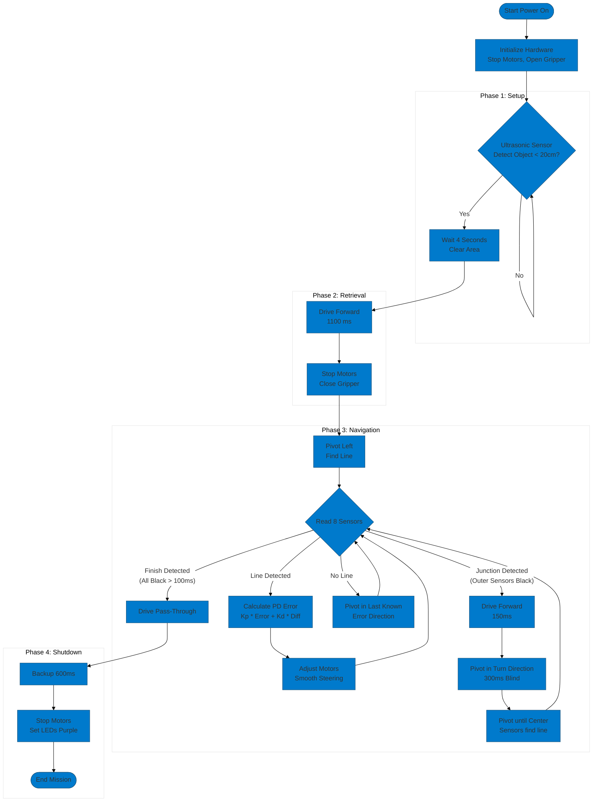

# BattleBot 
> **Module:** Autonomous Robotics  
> **System:** Arduino-based State Machine with PD Line Following

### System Activity Diagram


---

## 1. Main Loop & States
The core of the robot is a **Finite States (FSM)**. The `loop()` function acts as a central dispatcher, ensuring that only the logic for the current mission phase is executed.

* **STATE_DISPATCH:** Transitions are handled via the `currentRobotState` variable.
* **SYSTEM_TICK:** `refreshServo()` and `updateLEDs()` run every cycle to maintain hardware stability.

---

## 2. Start & Retrieval Procedure
The robot follows a strict sequence to clear the starting area and secure the target.

| Phase | Action | Criteria |
| :--- | :--- | :--- |
| **WAIT_FOR_START** | Ultrasonic Polling | Distance < 20cm triggers 4s delay |
| **CONE_STATE** | Forward Drive | Constant speed for 1100ms |
| **CONE_GRAB** | Actuator Engage | Sets `isGripperClosed = true` |
| **ON_COURSE** | Path Entry | Timed 90° pivot to find the track |

---

## 3. Line Following & Navigation
The robot utilizes a **Proportional-Derivative (PD)** controller for smooth navigation and high-speed stability.

### Steering Logic
The error is calculated across an **8-sensor array** (A0-A7) using a weighted average.
* **Proportional (Kp):** Corrects based on current distance from the center.
* **Derivative (Kd):** Dampens the steering to prevent high-speed oscillation.

### Junction & Search Logic
* **Crossing:** Upon detecting a horizontal line (outer sensors active), the robot drives forward 150ms to align its pivot point.
* **Turning:** Executes a pivot in the `pendingTurnDirection`.
* **Search/Recover:** If the line is lost, the robot initiates a search pattern based on the last known error direction.

---

## 4. Finish Procedure
The finish sequence ensures the robot stops safely and clears the scoring zone.

1.  **Detection:** Sustained "All-Black" detection across sensors for 100ms.
2.  **Pass-Through:** Drives forward to ensure the chassis has crossed the line.
3.  **Positioning:** Executes a **Backup** command for 600ms to center itself.
4.  **Shutdown:** Motors are disabled, and NeoPixels switch to **Purple (DONE)**.

---

## 5. Helper Sub-Systems
Technical functions that support the main logic:

* **`refreshServo()`**: A non-blocking pulse manager that sends signals to the gripper every 20ms without using `delay()`.
* **`setMotorSpeed()`**: An abstraction layer that handles PWM constraints (-255 to 255) and directional pin logic.
* **`updateLEDs()`**: A telemetry system providing real-time visual feedback on the internal state of the robot.

---

## Project Source
You can find the full code and version history here:
[Race Day Test Code - Group A Team A3](https://github.com/CalebGaitou/GroupA-TeamA3/tree/main/Week%208%20(Race%20Day)/RaceTest)

---

## Tuning Constants
Current optimized values for the competition track:

```cpp
const float KP_GAIN = 20.0;             // Aggressiveness of turn
const float KD_GAIN = 12.0;             // Stability/Dampening
const int SPEED_BASE = 200;             // Standard cruise PWM
const int OBSTACLE_THRESHOLD_CM = 20;   // Start trigger distance